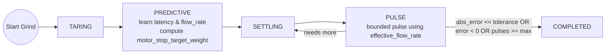

# Smart Grind-by-Weight

> **Community-maintained fork.** This fork collects tested fixes and improvements while the original project is inactive. It currently includes Waveshare 1.64-inch V2 support, the desktop simulator, and display/swipe performance improvements. The original project and its author remain credited below.

## Coast compensation

The **Menu → Grind Mode → Coast Compensation** slider adjusts the existing latency-based coast estimate from 70% to 150% in 5% increments and stores the selection in NVS. The default is 100%, which preserves the previous firmware behaviour until the user deliberately changes it. This setting is a multiplier; the firmware does not currently learn a median coast value from earlier grinds.

See the [community roadmap](docs/COMMUNITY_ROADMAP.md) for the Wi-Fi OTA, live web UI, native Home Assistant integration and upstream contribution plan.

## Community development timeline

| Stage | Status | Outcome |
| --- | --- | --- |
| V1/V2 maintained baseline | Complete | Tested firmware, V2 wiring, simulator, and faster/reliable display gestures |
| Public web flasher and releases | Complete | Explicit controller-generation selection and downloadable, reproducible V1/V2 firmware packages |
| Wi-Fi provisioning and safe OTA | Implemented; hardware validation pending | Reliable network setup, discovery, and physically armed browser-based full-image updates |
| Shared live device API | Implemented; hardware validation pending | Bounded 10 Hz WebSocket state feed with safe stop/dismiss requests |
| Native Home Assistant integration | High priority | Zeroconf discovery and local-push entities without requiring MQTT Discovery |
| Live grinder web UI | Implemented; hardware validation pending | Real-time weight, grind state, controls, and rolling graph using the same device API |

Each substantial pull request updates this status, its relevant user/developer documentation, and its release notes. The [detailed roadmap](docs/COMMUNITY_ROADMAP.md) records the architecture and contribution plan.

The network work follows the independently implemented design in
[Wi-Fi, Web and Home Assistant Architecture](docs/WIFI_ARCHITECTURE.md). It uses
lessons from GaggiMate's mature ESP32 appliance behaviour—secured captive setup,
careful reconnect/mDNS lifecycle, guarded OTA and bounded WebSocket clients—
without copying its source code. The secured setup access point and official
Improv USB serial protocol provide two independent provisioning paths.

**Turn any grinder into a precision smart grind-by-weight system**

<table>
<tr>
<td width="50%">

https://github.com/user-attachments/assets/e20ce3e2-417e-4a3b-bb48-05591fce9418


</td>
<td width="50%">

[](media/smart-grind-by-weight-render.PNG)

</td>
</tr>
</table>

> **⚠️ Newly Released Mod - Buyer Beware!**  
> This is a **recently released modification project** that transforms grinders into smart grind-by-weight systems. While functional and free/open source, it's should be considered an **experimental mod** that requires technical skill to build and may have rough edges. **Build at your own risk** !


The Smart Grind-by-Weight is a user-friendly, touch interface-driven, highly accurate open source grinder modification that can transforms any grinder (with a accesable motor relay) into an intelligent grind-by-weight system. Originally developed for the Eureka Mignon Specialita, the system can be easily adapted for other grinders.

**The concept is simple:** Perform a "brain swap" on your grinder. Replace the original controller with our intelligent ESP32-S3 controller and add a precision load cell to the mix.

**Upgrade cost:** €30-40 in parts  
**Target accuracy:** ±0.03g tolerance  
**No regrets**: No permanent modifications, and original grind-by-time mode is also available

---

## ✨ Features

- **User-friendly interface** with 3 profiles: Single, Double, Custom
- **Beautiful display** with simple graphics or detailed charts (easily switchable)
- **High accuracy**: ±0.03g error tolerance  
- **Zero-shot learning**: Algorithm adapts instantly to any grind size, bean setting, humidity etc. without manual tuning
- **Original timed run preserved** – there is a setting to enable the original Grind-By-Time mode
- **BLE OTA updates** for firmware
- **Advanced analytics** using BLE data transfer and Python Streamlit reports
- **For Eureka**: No permanent modifications needed - just swap the screen and add 3D printed parts

---

## 🧠 Intelligent Grinding Algorithm

Our predictive grinding system uses a zero-shot learning approach that adapts to any conditions:



**Key Innovation:** The algorithm learns grind latency and flow rate in real-time, then uses predictive control to stop just before the target weight, followed by precision pulses to reach exact accuracy. No manual tuning required.

---

## 🚀 Quick Start

### For Users - Using Pre-built Firmware

1. **Get the parts** - ESP32-S3 AMOLED display + HX711 + load cell (~€35 total) → See [Parts List](docs/DOC.md#-parts-list)
2. **3D print the mounting parts** - All STL files included, no supports needed → See [3D Printed Parts](docs/DOC.md#3d-printed-parts) | [Community Designs](docs/3D_PRINTS.md)
3. **Check your board revision, wiring, then flash & calibrate** - The 1.64-inch board has incompatible V1 and V2 display firmware and different external GPIO assignments. V2 uses GPIO 1 for HX711 SCK and GPIO 16 for motor control. See [Display stays black after flashing](docs/TROUBLESHOOTING.md#display-stays-black-after-flashing-waveshare-164-v2), then choose the matching V1/V2 image in the [Community Web Flasher](https://clinteastman.github.io/smart-grind-by-weight/) (Chrome/Edge desktop + Android only) or build the matching command-line target
4. **Follow the assembly video** - [Complete Eureka build process](https://youtu.be/-kfKjiwJsGM)

**Ready to build?** → See **[DOC.md](docs/DOC.md)** for complete build instructions, parts list, and usage guide.

---

### For Developers - Building from Source

If you want to modify the code or contribute to development, see **[DEVELOPMENT.md](docs/DEVELOPMENT.md)** for build instructions.

**Design Files:** The complete Fusion 360 design is available at `3d_files/smart-grind-by-weight. Eureka Mignon.f3z` for modification and adaptation to other grinder models.

---

## 📊 Analytics Dashboard

[](media/analytics.png)

Export your grind data and analyze it with the included Streamlit dashboard:

```bash
python3 tools/grinder.py analyze
```

Track accuracy, flow rates, grind times, and optimize your coffee workflow with detailed session analytics.

---

## 🙏 Credits & Inspiration

This project was inspired by and builds upon the excellent work of:

- **[openGBW](https://github.com/jb-xyz/openGBW)** by jb-xyz - Open source grind-by-weight system
- **[Coffee Grinder Smart Scale](https://besson.co/projects/coffee-grinder-smart-scale)** by Besson - Smart scale integration concepts

---

## 📝 Personal Note

My goal with this project was to get real-life experience coding with AI agents. The code reflects that learning journey. I've learned a lot, and ultimately I'm in awe of how fast you can produce results with AI assistance. 

What I've learned so far is that "vibe coding" with AI is great for POCs and testing theories. But afterward you must pivot and reimplement features while keeping a close eye on the architecture the AI produces. Otherwise you'll get stuck at dead ends that require painful refactoring (been there, done that). 

In this project, that's most obvious when at state management - it's a bit cluttered in places. I'm very happy with the end result and I'm releasing the project as is. It eliminates grind weight variability from the espresso equation, bringing you one step closer to dialing in perfect shots.

**Project Status**: This project is shared 'as-is' and I have limited availability for support. While I'm happy to share what I've built, please understand that troubleshooting and feature requests may receive limited attention.

**Want to dive deeper?** → Check out **[DOC.md](docs/DOC.md)** for comprehensive documentation.

**Different grinder?** → See **[Grinder Compatibility Matrix](docs/GRINDER_COMPATIBILITY.md)** for adaptation guidance.

**Having issues?** → See **[TROUBLESHOOTING.md](docs/TROUBLESHOOTING.md)** for common problems and solutions.

**Changelog & Updates** → See **[Community Releases](https://github.com/Clinteastman/smart-grind-by-weight/releases)** for tested builds from this fork. The [original releases](https://github.com/jaapp/smart-grind-by-weight/releases) remain available for reference.
