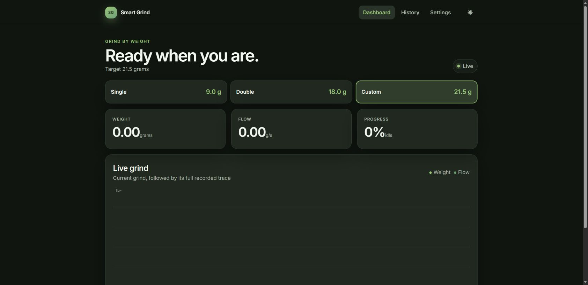
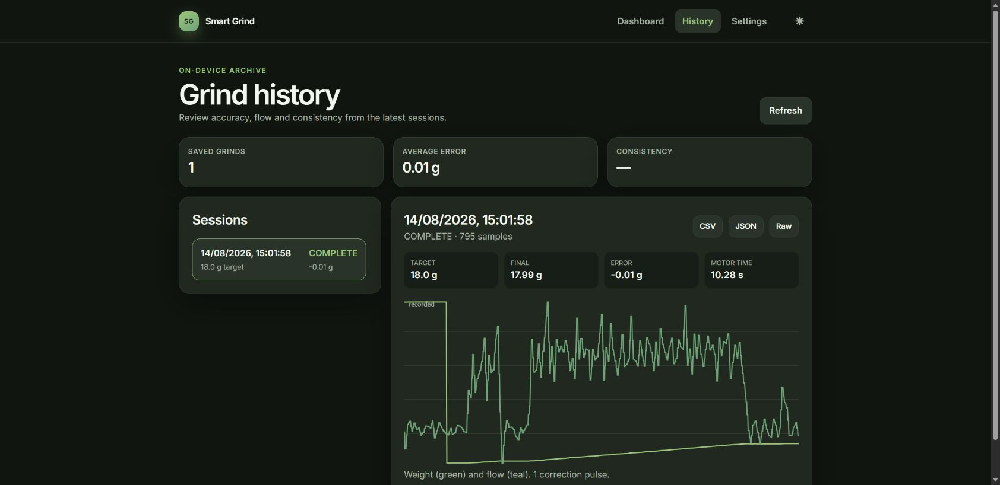
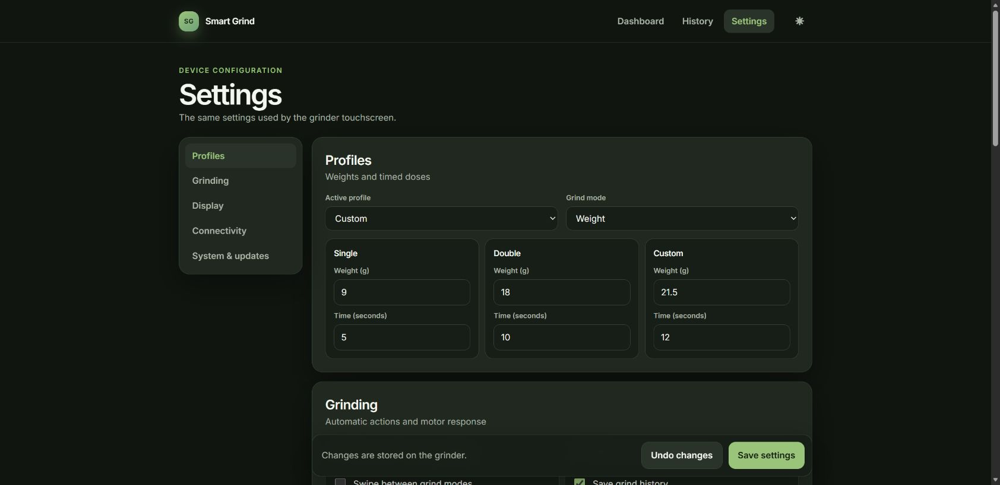
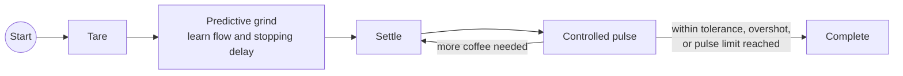

# Smart Grind-by-Weight

   

Turn a compatible coffee grinder into a precise, touch-controlled
grind-by-weight system using a Waveshare ESP32-S3 AMOLED board and load cell.
Smart Grind learns the grinder's live flow and stopping delay, switches the
motor off before the target, then uses controlled pulses to finish the dose.

> **Community-maintained fork.** This repository continues the
> [original Smart Grind-by-Weight project](https://github.com/jaapp/smart-grind-by-weight)
> with tested hardware support and new releases while upstream maintenance is
> limited. The original project, author and community contributors remain
> credited, and retained commits preserve their authorship.

**[Flash firmware](https://clinteastman.github.io/smart-grind-by-weight/)** ·
**[Build guide](docs/DOC.md)** ·
**[What's new in v1.5.2](CHANGELOG.md#152---2026-08-15)** ·
**[Troubleshooting](docs/TROUBLESHOOTING.md)**

> [!TIP]
> **v1.5.2** includes the target-free Manual grinding and polished browser
> controls introduced in v1.5.1, and fixes one-click V1/V2 firmware downloads
> from GitHub on the grinder. Read the
> [v1.5.2 changelog](CHANGELOG.md#152---2026-08-15) or install it from the
> [Community Web Flasher](https://clinteastman.github.io/smart-grind-by-weight/).

<table>
<tr>
<td width="50%">

https://github.com/user-attachments/assets/e20ce3e2-417e-4a3b-bb48-05591fce9418

</td>
<td width="50%">

</td>
</tr>
</table>

## Features

- **Accurate grind-by-weight control** with predictive motor stopping,
  controlled finishing pulses and a configurable control tolerance of
  ±0.03 g.
- **Three editable profiles** for Single, Double and Custom doses, synchronized
  between the touchscreen and browser.
- **Target-free Manual mode** with one-tap start/stop, large optional live
  weight and TARE controls, elapsed time, motor-only lifetime accounting and an
  independent 30-second safety cutoff.
- **Grind-by-time mode** for the original timed workflow, including pause and
  resume and operation without a load cell.
- **Responsive AMOLED interface** with chart and arc views, faster partial
  display updates and reliable short-swipe gestures.
- **Adjustable coast compensation** from 70% to 150%, stored on the grinder;
  the neutral 100% default preserves the original behaviour.
- **Built-in screensavers** plus custom RGB565 image upload, configurable
  brightness, startup display and idle timeout.
- **Local Wi-Fi web app** with light/dark themes, live weight and flow, saved
  dose selection, round start/stop control, settings, grind history, analytics
  and data downloads.
- **Wi-Fi setup on the device** with network scanning, a secured captive portal,
  QR access, Improv Serial provisioning and `smartgrind.local` discovery.
- **One-click firmware updates from GitHub**, with automatic stable-release
  checks and strict V1/V2 image selection, plus manual Wi-Fi/Bluetooth upload
  and USB recovery.
- **On-device diagnostics** with downloadable retained startup/runtime logs.
- **V1 and V2 Waveshare support**, reproducible CI builds, a public web flasher
  and a deterministic Windows desktop simulator for development.

Network clients request a selected-profile start or stop through the same grind
controller used by the touchscreen; they never drive the relay directly. The
firmware remains responsible for load-cell checks, state transitions and motor
safety.

## Web interface

The responsive web interface is served directly by the grinder at
`http://smartgrind.local`; no cloud account or separate application is needed.
Choose a saved dose, start or stop it with the round grind control, follow the
current grind, review its full recorded trace, change grinder/display settings
and install the latest stable firmware from a browser on the same network. The
System & updates page checks this project's GitHub releases and selects the
matching V1 or V2 application image automatically; manual upload remains
available as an advanced fallback. If mDNS is unavailable, use the IP address
shown on the grinder's Wi-Fi screen.

<table>
<tr>
<td width="50%"><strong>Live dashboard</strong> </td>
<td width="50%"><strong>Grind history</strong> </td>
</tr>
</table>

<strong>Grinder settings</strong> 

The grinder retains the latest 10 logged sessions with accuracy, consistency,
weight and flow data. Each session can be downloaded as CSV, JSON or its
original raw record. BLE export and the Python analysis tools remain available
for longer-term archives and recovery workflows.

## Quick start

> [!CAUTION]
> This is an experimental mains-powered appliance modification. Disconnect the
> grinder from power before opening it, preserve protective earth and insulation,
> and ask a qualified person to handle mains wiring if you are not competent to
> do so. Build and use it at your own risk.

1. **Check compatibility and collect the parts.** Start with the
   [parts list](docs/DOC.md#-parts-list) and
   [grinder compatibility matrix](docs/GRINDER_COMPATIBILITY.md).
2. **Print the mounting parts.** Use the included STL files and review the
   [community 3D-print designs](docs/3D_PRINTS.md).
3. **Identify the controller generation before flashing.** The 1.64-inch V1
   and V2 boards require different display firmware and external GPIO wiring.
   Do not rely on the ambiguous `Rev1.1` PCB text alone; use the photographs and
   connector/component checks in
   [Display stays black after flashing](docs/TROUBLESHOOTING.md#display-stays-black-after-flashing-waveshare-164-v2).
4. **Flash the matching image.** Open the
   [Community Web Flasher](https://clinteastman.github.io/smart-grind-by-weight/)
   in Chrome or Edge on desktop/Android and explicitly select V1 or V2. USB
   recovery instructions and command-line alternatives are in the
   [development guide](docs/DEVELOPMENT.md).
5. **Wire, assemble and calibrate.** Follow the full
   [assembly and usage guide](docs/DOC.md) and the
   [Eureka build video](https://youtu.be/-kfKjiwJsGM). On the verified V2
   installation, HX711 SCK is GPIO1 and the motor relay is GPIO16; GPIO18 is
   reserved by the touch controller.

The original timed mode remains available, and the documented Eureka
installation can be reversed without permanently modifying the grinder body.

For an uncomplicated target-free run, swipe to **Manual**, the first main-screen
page. If a scale is fitted, place the empty cup on it and tap **TARE**, then tap
**START**. Tap **STOP** when enough coffee has been ground. The large live weight
remains available before and after grinding. Manual mode never requires or
automatically tares the load cell and stops automatically after 30 seconds.

## How grinding works

The controller learns flow and motor latency during each grind, predicts when
to stop before the requested weight, then evaluates the settled dose. Short,
bounded pulses finish an under-target dose without requiring a pre-trained bean
or grind-size profile. Coast compensation lets experienced users scale the
latency estimate while leaving the neutral default unchanged.

## Community development status

All feature rows below are implemented for both V1 and V2 and both firmware
targets pass CI. Physical acceptance has been completed on V2 because that is
the hardware currently available to the maintainers; there are no known V1
incompatibilities, and a community V1 hardware acceptance run is welcome.

| Stage | Status | Outcome |
| --- | --- | --- |
| V1/V2 maintained baseline | Complete | Tested firmware targets, V2 wiring, simulator and faster/reliable display gestures |
| Public web flasher and releases | Complete | Explicit controller-generation selection and downloadable, reproducible V1/V2 packages |
| Wi-Fi provisioning and safe OTA | Complete | Reliable setup, `smartgrind.local` discovery, one-click stable-release updates and manual full-image upload |
| Shared live device API | Complete | Bounded 10 Hz WebSocket feed, correlated controller-backed grind/profile/tare requests, settings and history APIs |
| Live grinder web UI | Complete | Dashboard, live/completed graphs, settings, history/analytics, downloads, OTA and screensavers |
| Native Home Assistant integration | Validation in progress | [Separate Zeroconf/local-push integration](https://github.com/Clinteastman/smart-grind-home-assistant); live Home Assistant acceptance remains |

The [community roadmap](docs/COMMUNITY_ROADMAP.md) records the detailed delivery
status, reviewed upstream work and contribution plan. The independently
implemented [Wi-Fi, Web and Home Assistant architecture](docs/WIFI_ARCHITECTURE.md)
uses lessons from mature ESP32 appliance projects without copying their source.

## Development and contributing

See [DEVELOPMENT.md](docs/DEVELOPMENT.md) for the PlatformIO targets, simulator,
tests and contribution workflow. Build and flash operations use a project lock,
and V1/V2 compiled-object caches are isolated to prevent board-specific LVGL
objects from mixing.

The complete editable Fusion 360 design is included at
`3d_files/smart-grind-by-weight. Eureka Mignon.f3z`.

Please report reproducible problems through
[GitHub Issues](https://github.com/Clinteastman/smart-grind-by-weight/issues),
including the board generation, firmware version and a diagnostic log where
possible. Tested V1 hardware feedback is particularly useful.

## Credits

- Smart Grind-by-Weight was originally created by
  [Jaap Pieroen (@jaapp)](https://github.com/jaapp). This fork retains Jaap's
  original commit history and remains licensed under GPLv3. The
  [upstream README](https://github.com/jaapp/smart-grind-by-weight#readme)
  preserves the original author's project introduction and personal note.
- v1.5 incorporates reviewed contributions from
  [Randy1st](https://github.com/Randy1st),
  [Woutifier](https://github.com/Woutifier),
  [quickcoffee](https://github.com/quickcoffee) and
  [FleischerT](https://github.com/FleischerT). See the
  [v1.5 changelog](CHANGELOG.md#community-contributions) for the source PRs.
- The project was inspired by
  [openGBW](https://github.com/jb-xyz/openGBW) by jb-xyz and
  [Coffee Grinder Smart Scale](https://besson.co/projects/coffee-grinder-smart-scale)
  by Besson.

## Releases and license

Read the versioned [changelog](CHANGELOG.md), download tested builds from
[Community Releases](https://github.com/Clinteastman/smart-grind-by-weight/releases),
or consult the [original release archive](https://github.com/jaapp/smart-grind-by-weight/releases).

Smart Grind-by-Weight is free software distributed under the
[GNU General Public License v3.0 or later](LICENSE).
